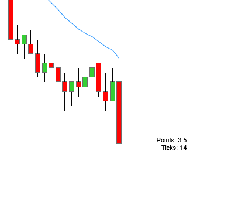
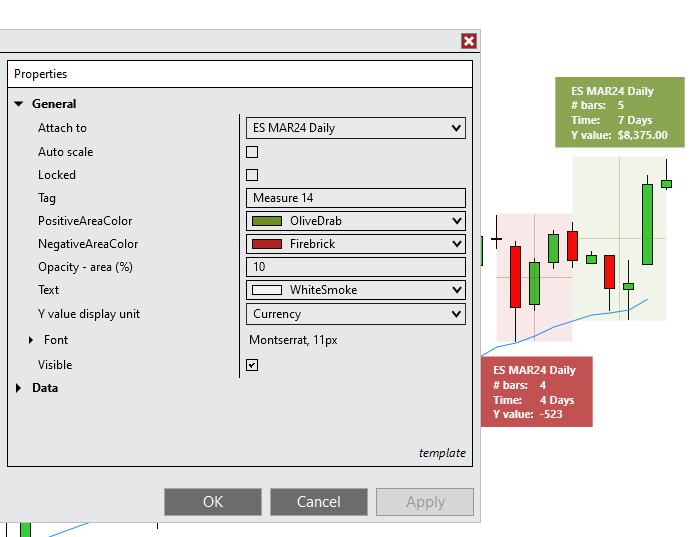

# Ninjatrader Custom Indicators and Tools

## Indicators

### BarSizeCounter

Displays the current bar size in points & ticks next to the bar. Text distance, font and background are adjustible.

## Drawing Tools

### Measure2

A quick measure tool to display information similar to the measuring tool in TradingView.

## Installation

1. Import the chosen .zip file in the repo in NT: `Tools > Import > NinjaScript Add-On`
2. For Drawing Tools adjust the hotkey in `Tools > Hotkeys > Chart`, for indicators add them on the chart `Right Click > Indicators`.