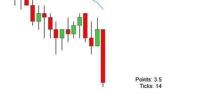

# Ninjatrader Custom Indicators and Tools

## Drawing Tools

### Measure

A quick measure tool to display information similar to the measuring tool in TradingView.

### Better Channel

A better channel tool with a mid-line anchor and context menu to change between commonly used colors.

### Measured Move

A measured move tool with extendable anchor points.

### Better Arrows

A Better Arrow (Up and Down) tool with context menu to change between common colors.

## Indicators

### BarSizeCounter

Displays the current bar size in points & ticks next to the bar. Text distance, font and background are adjustible.

### Repeater (By NinjaTrader_Paul)

Allows to repeatedly set Highlight regions, i.e. to better identify premarket hours. 

## BarTypes

### Trend Reversal

Modified Renko bars (candle opens at the same price as previous candle close).

## Installation

1. Import the .zip file in the repo in NT: `Tools > Import > NinjaScript Add-On`
2. For Drawing Tools adjust the hotkey in `Tools > Hotkeys > Chart`, for indicators add them on the chart `Right Click > Indicators`.